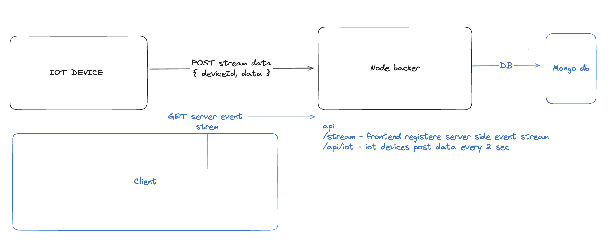

## Project : Real-Time Updates in MERN Applications with Server-Sent Events

## Understanding Server-Sent Events

Server-Sent Events (SSE) is a standard mechanism for pushing real-time updates from a server to a client over an HTTP connection.**Unlike WebSockets, which provide full-duplex communication channels, SSE is unidirectional**, allowing servers to send data to clients but not vice versa. SSE is particularly **useful for scenarios where only the server needs to initiate communication**, such as broadcasting updates or notifications to clients.

## scenario
Let's consider a use case where we want to display real-time updates on the frontend whenever devices send data to our server. This could be applicable in scenarios such as IoT applications where multiple devices are constantly sending sensor data to be displayed in a dashboard. 

## To Run backend, client and device stimulation
run command - docker compose up -d

## frontend : 
link - http://localhost:9000/  
## backend : 
link - http://localhost:4000/ 
